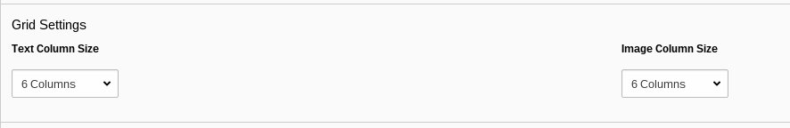

# Bootstrap styled Text with Media Element for TYPO3

Text & Media Element adaption for FluidStyledContent.

## Description

This extensions will give you Fluid Styled Content Elements for
Text with Media elements. Both a `standalone` element that adds a new element
"Text & Media: Bootstrap" and a `replace` option are available.

By default, the standalone variant will be placed in the new content 
element wizard as well. Disable this behaviour in the extension manager.

## Remarks

Just like the original "Text & Media" elemtent, this doesnt give you the
ability to render images "in text". If you need these options, please
override the partial `ContentElements/WsTextmediaBootstrap/BootstrapMediaGallery.html`
and the appropriate template file for your case.

The `in text left` and `in text right` options will default to the `besides`
options.

## License

GPL3
